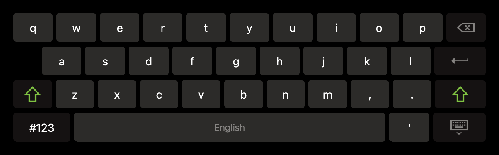
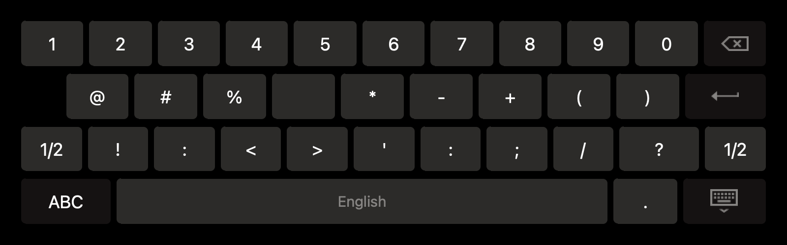
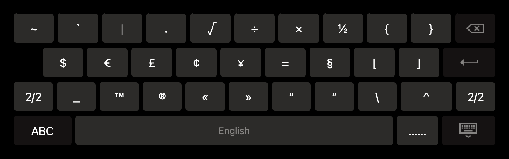

# Look like Qt Primary Keyboard
Pure C++ QWidget, Not QML. Use Qt5.12.12 Private Interface. Perhaps not adapt to other versions.<br>
Plug-in Library.<br>
```bash
export QT_IM_MODULE=QtKeyboard
./application
```

# Further plan
| Feature | Status |
| --- | --- |
| dev | bad |
| refact | How to design? |

## Showcase
### Retro


---
### Style 1



